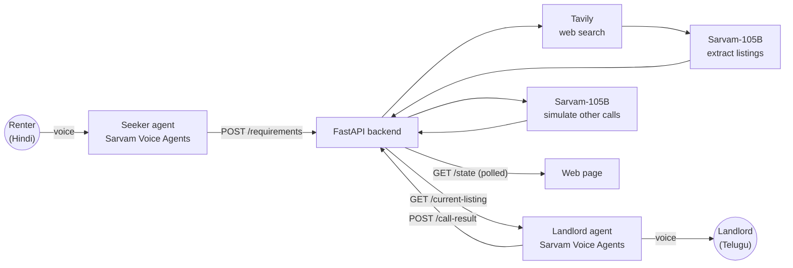

# Kiraya · किराया · అద్దె

**An AI broker that helps a Hindi-speaking migrant find a PG (paying-guest room) in Hyderabad: it searches the web for real listings and negotiates with landlords in Telugu. Built on Sarvam AI.**

> Built in a 3-hour hackathon.

<!-- DEMO VIDEO: on github.com, click "Edit README", drag your .mp4 onto this line, and GitHub embeds it. -->

<!-- SCREENSHOTS: add docs/renter.png, docs/agent.png, docs/found.png and uncomment:
| Talk in Hindi | The agent at work | Found & negotiated |
|---|---|---|
|  |  |  |
-->

## The problem

Every year, lakhs of people move to Hyderabad for work. Many speak Hindi; most PG owners speak Telugu. Finding a room means scrolling listing sites with unreliable prices, then phoning landlords you can't easily talk to.

## What Kiraya does

1. **You talk, in Hindi.** A voice agent asks four things: area, budget, veg/non-veg, move-in date.
2. **It searches the web.** A search agent finds real PG listings and uses **Sarvam-105B** to turn messy web pages into clean, structured listings, then filters and ranks them.
3. **It calls landlords, in Telugu.** A second voice agent phones the top listing and negotiates the rent toward your budget. In the demo, *you* play the landlord.
4. **It tells you where to go.** Sarvam-105B predicts how calls to the other shortlisted PGs would go (clearly marked *simulated*), and Kiraya recommends one, preferring a **confirmed** price from a real call over a predicted one.

## How it works



| Piece | What it does |
|---|---|
| `main.py` | FastAPI app: the API the voice agents call, in-memory state, serves the web page, relays voice-call auth |
| `search_agent.py` | Builds queries → Tavily → Sarvam-105B extraction → filter & rank → fallback |
| `simulator.py` | Predicts the other landlord calls with Sarvam-105B; picks the final recommendation |
| `sarvam.py` | Small helper: call Sarvam-105B, get JSON back safely |
| `frontend.html` | The whole UI in one file, served at `/` |
| `e2e_test.py` | Plays both voice agents and checks every endpoint against the API contract |

## Engineering notes

A few things that weren't obvious:

- **Reasoning off made the LLM 10× faster.** With Sarvam-105B's default reasoning on, listing extraction took ~37s and sometimes used every token "thinking", returning nothing. With `reasoning_effort: null` it takes ~3s and returns clean JSON.
- **Keep the demo alive no matter what.** If search fails, takes over 25s, or finds too little, the backend silently uses a saved real shortlist; if the LLM fails, the simulator falls back to rule-based estimates. Messy voice-agent output (`"₹9,000"`, `"Vegetarian"`, `"true"`, empty fields) is normalised rather than rejected.
- **Don't trust the LLM blindly.** Extracted listings are dropped unless their `source_url` was actually one of the search results, generic names ("PG for Boys in Ameerpet") are filtered out, near-duplicates are merged, and simulated rents far from the listed price are replaced.
- **The API key never reaches the browser.** The page uses Sarvam's browser SDK, but its one keyed request (a short-lived signed WebSocket URL) goes through a backend relay that adds the key and only allows this project's two agents. The browser then streams audio straight to Sarvam.
- **A prompt-templating bug found through call transcripts.** The landlord agent read `{seeker_move_in_date}` aloud: the platform only substitutes `{{double_braces}}`. Found by reading the call trace, confirmed with a text-chat test using deliberately distinctive default values.

## API

| Endpoint | Called by | Purpose |
|---|---|---|
| `POST /requirements` | Seeker agent (end of call) | `{area, max_budget, food_preference, move_in_date}` → starts the search in the background |
| `GET /current-listing` | Landlord agent (start of call) | Top listing merged with the seeker's needs |
| `POST /call-result` | Landlord agent (end of call) | Negotiation outcome → starts the simulator |
| `GET /state` | Web page (every 2s) | Everything: stage, shortlist, results, recommendation |
| `POST /reset` | Web page | Start over |

Stages: `idle → requirements_received → searching → shortlist_ready → calling → call_done → simulating → complete`

## Run it locally

Needs Python 3.10+.

```bash
git clone <this repo>
cd <repo folder>
python3 -m venv .venv
.venv/bin/pip install -r requirements.txt
cp .env.example .env        # then fill in your keys
.venv/bin/uvicorn main:app --port 8000
```

Open http://localhost:8000. The voice agents live on Sarvam's platform, so they need a public URL for your backend (e.g. `ngrok http 8000`) set in their API tools. Without voice keys, you can still run the whole pipeline with the test script:

```bash
.venv/bin/python e2e_test.py
```

## Honest limitations

- Only **one** landlord call is real; the rest are LLM predictions, and the UI labels them as such.
- State is in memory and shared: one demo at a time, lost on restart.
- Listings come from public web pages, so prices and names can be out of date.

## Team

- **Twesha Saini:** backend, search agent, simulator, voice-call relay, web frontend, and the agent integration
- **Lekhna Sruthi:** the Sarvam voice agents (Hindi seeker, Telugu landlord)

Built with [Sarvam AI](https://www.sarvam.ai) (Sarvam-105B, Voice Agents), [Tavily](https://tavily.com), and FastAPI.
